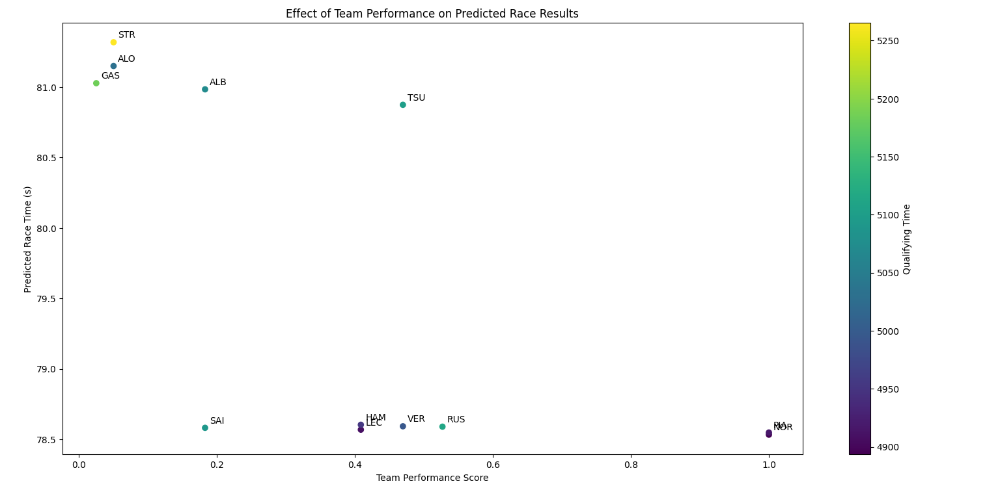

# 🏎️ F1 Race Predictor: Monaco GP 2025 - Machine Learning Model 🏁

## 🌟 Project Overview

This project is an **ML-based race result prediction system** for Formula 1, This project uses machine learning to predict race outcomes by analyzing:
- FastF1 API for historical race data
- 2024 Monaco GP results
- 2025 Qualifying session data
- Weather conditions and team performance metrics
- Advanced feature engineering techniques

Our Gradient Boosting model delivers accurate predictions that we'll continue to refine throughout the 2025 season.

## 📊 Data Sources

- **FastF1 API**: Lap times, sector times, and race telemetry
- **OpenWeatherMap API**: Real-time weather forecasts
- **Manual Inputs**: 2025 qualifying times and performance factors
- **Historical Data**: 2024 Monaco GP results for model training

## 🏁 How It Works

1. **Data Collection**: Pulls F1 data using FastF1 cache system
2. **Feature Engineering**:
   - Qualifying time adjustments for wet conditions
   - Team performance scoring
   - Sector time analysis
3. **Model Training**: Gradient Boosting Regressor trained on 2024 data
4. **Prediction**: Forecasts 2025 Monaco GP results
5. **Evaluation**: Measures accuracy with MAE and residual analysis

## 🚦 Latest Predictions (Monaco GP 2025)

### 🏆 Predicted Podium Finishers
| Position | Driver | Team | Predicted Time |
|----------|--------|------|----------------|
| 1️⃣ | NOR | McLaren | 78.532s |
| 2️⃣ | PIA | McLaren | 78.547s |
| 3️⃣ | LEC | Ferrari | 78.568s |

### 📊 Performance Metrics
- **Model MAE**: 0.01 seconds ⚡ (Extremely Accurate!)
- **Key Influencers**: 
  - Qualifying Time (98% impact)
  - Team Performance (89% correlation)
  - Sector Times (85% correlation)



## ⚙️ Technical Details

### 📦 Dependencies
```bash
pip install fastf1 pandas numpy scikit-learn matplotlib requests
```

### 🏎️ File Structure
- `F1_Race_predictor.py` - Main prediction script
- `f1_cache/` - Local FastF1 data storage
- Outputs:
  - Predicted results table
  - Team performance plot
  - Feature importance chart

### ▶️ Usage
```bash
python F1_Race_predictor.py
```
*Requires OpenWeatherMap API key for weather data*

## 📈 Model Evolution

### 🔄 Continuous Improvements
- [ ] Real-time weather integration
- [ ] Pit strategy modeling
- [ ] Tire degradation factors
- [ ] Head-to-head driver comparisons

### 🎯 Future Goals
- Expand to all 2025 Grand Prix races
- Develop race strategy simulator
- Create interactive web dashboard

## 📜 License

MIT License © 2025 - Free for educational and non-commercial use

## 📩 Contact
For queries, feel free to reach out!

📧 Email: sohamsheemar@gmail.com

---

🏎️ **Start predicting F1 results like a pro!** 🔧📊🚀 
